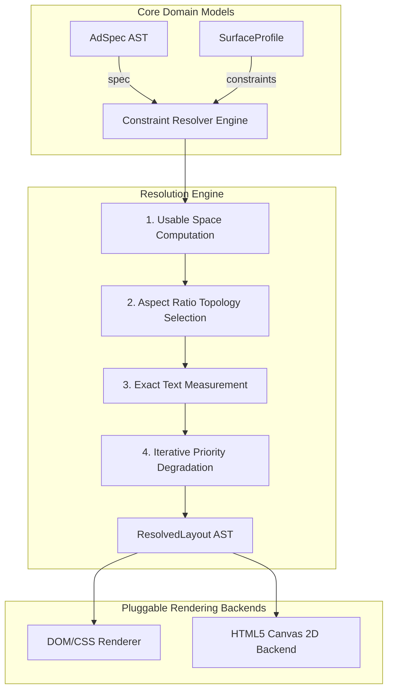

# Architecture & System Design Specification

## System Overview

The **Adaptive Layout Engine** decouples ad content representation from surface execution constraints.

## Module Separation of Concerns

1. **`src/spec.ts`**: Immutable Abstract Syntax Tree (AST) representing an ad campaign's creative intent.
2. **`src/surfaces.ts`**: Environmental & physical target surface constraint profile.
3. **`src/text-measurer.ts`**: Offscreen Canvas text dimension & line wrapping measurement.
4. **`src/resolver.ts`**: Pure mathematical solver function. Contains zero DOM or UI framework dependencies.
5. **`src/render-dom.tsx`**: React DOM component rendering pixel-accurate coordinates, safe area guides, and Framer Motion transitions.
6. **`src/render-canvas.ts`**: Pure Canvas 2D graphics renderer.

## Extensibility

- **Adding a New Renderer**: Implementing a WebGL or PDF renderer requires only consuming `ResolvedLayout.elements` rectangles and typography metadata without touching `resolver.ts`.
- **Adding a New Surface Constraint**: Surface profiles accept arbitrary dimensions, safe areas, legibility thresholds, and touch flags without altering the resolver logic.
